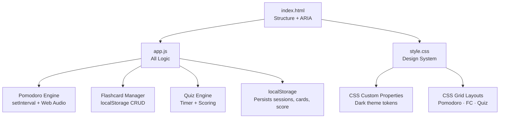

*This is a submission for the [Hacktoberfest Weekend Challenge: Build for a Friend](https://dev.to/challenges/hacktoberfest-weekend-2026-10-01)*

---

## What I Built

**StudyBuddy** is a browser-based productivity + learning app I built for my friend — a college student who was juggling exam prep across three different tools: a phone timer for Pomodoro, a notes app for flashcards, and a Google Form quiz a teacher shared. Every session, they'd context-switch between apps, lose focus, and end up doomscrolling between switches.

StudyBuddy collapses all three into one beautiful, distraction-free dark-mode app that lives entirely in the browser — no login, no account, no backend.

### Features

#### ⏱️ Pomodoro Timer
- Animated circular ring timer with a gradient stroke that depletes in real time
- Three modes: **Focus**, **Short Break**, **Long Break** — fully configurable
- Session dot tracker (dots turn green as sessions complete)
- Sound alerts via the Web Audio API — no external files
- Auto-start next session toggle
- Keyboard shortcuts: `Space` to start/pause, `R` to reset

#### 🃏 Flashcards
- Create cards with a **question** (front) and **answer** (back)
- Silky smooth **3D flip animation** on click or `Space`
- Navigate with arrow buttons or `← →` keys
- Optional **deck/tag** label per card
- After flipping: rate each card as **Hard / OK / Easy** for self-paced spaced repetition
- Full card list with per-card delete; all data persists via `localStorage`

#### 🧠 Quiz Mode
- Build custom **multiple-choice questions** (up to 4 options each)
- Mark the correct answer with a ✓ toggle right in the builder
- Per-question **countdown timer** (configurable 5–300 s) with urgent pulsing at ≤5 s
- Shuffle toggle for randomised question order
- Live score counter during the quiz
- Results screen: animated progress bar, score %, emoji feedback, and a full per-question review showing what you got wrong and what the right answer was

### Who it's for

Friends who were burning hours every week just managing study tools. Now they open one tab, set a 25-minute Pomodoro, reviews flashcards during the break, and takes a self-quiz at the end. Zero friction, zero context switching.

---

## Demo

🔗 **Live Demo:** [ujjwalgupta2021.github.io/StudyBuddy/](https://ujjwalgupta2021.github.io/StudyBuddy/)

> To run locally: clone the repo and open `index.html` directly in your browser — no build step, no `npm install`, no server required.

```bash
git clone https://github.com/ujjwalgupta2021/StudyBuddy.git
cd StudyBuddy
# Open index.html in your browser
start index.html        # Windows
open index.html         # macOS
xdg-open index.html     # Linux
```

---

## Code

🔗 **GitHub Repository:** [github.com/ujjwalgupta2021/StudyBuddy](https://github.com/ujjwalgupta2021/StudyBuddy)

The project is **vanilla HTML + CSS + JS** — three files, zero dependencies, zero build tooling.

| File | Role |
|------|------|
| `index.html` | Semantic structure, ARIA labels, all three tab panels |
| `style.css` | Dark glassmorphism design system — custom tokens, animations, responsive grid |
| `app.js` | All logic: timer engine, flashcard state, quiz engine, localStorage persistence |

### Architecture



### Highlights worth looking at

**Circular timer ring** — pure SVG with a `stroke-dashoffset` that ticks down in sync with `setInterval`:
```js
const CIRCUMFERENCE = 2 * Math.PI * 98; // 615.75px
function updateRing(fraction) {
  const offset = CIRCUMFERENCE * (1 - fraction);
  document.getElementById('ring-fill').style.strokeDashoffset = offset;
}
```

**3D card flip** — CSS `perspective` + `rotateY` with `backface-visibility: hidden`, zero JS for the animation:
```css
.fc-inner {
  transform-style: preserve-3d;
  transition: transform 0.55s cubic-bezier(.4, 0, .2, 1);
}
.fc-inner.flipped { transform: rotateY(180deg); }
```

**Sound alerts with no audio files** — Web Audio API oscillator, generated on the fly:
```js
function playBeep(freq = 800, vol = 0.3, dur = 0.3) {
  const osc = audioCtx.createOscillator();
  const gain = audioCtx.createGain();
  osc.connect(gain);
  gain.connect(audioCtx.destination);
  osc.frequency.value = freq;
  gain.gain.exponentialRampToValueAtTime(0.001, audioCtx.currentTime + dur);
  osc.start();
  osc.stop(audioCtx.currentTime + dur);
}
```

---

## How I Built It

I built StudyBuddy with **[Antigravity IDE](https://antigravity.dev)** — an open agentic coding assistant powered by **Google DeepMind's Gemini** models. The entire session was a dialogue: I described features, the agent scaffolded the HTML, generated the CSS design system, wrote the JavaScript logic modules, and I reviewed and iterated in real time.

The workflow was:

1. **Described the three feature areas** — the agent planned the tab structure and data model
2. **Design pass** — prompted for a dark glassmorphism aesthetic; the agent authored the full CSS custom-property token system
3. **Feature implementation** — timer engine, flashcard CRUD, quiz state machine — all built iteratively with me reviewing and adjusting
4. **Polish** — fixed layout gaps (the Pomodoro right-side empty space issue), resolved CSS linter warnings (`appearance` vendor prefix compatibility), tuned responsive breakpoints

The agent also caught and fixed a real CSS issue mid-session: `-moz-appearance: textfield` without the standard `appearance: textfield` companion — a cross-browser compatibility gap that linters flag.

**Open-source AI stack:**
- 🤖 **Antigravity IDE** — agentic coding assistant (Google DeepMind / Gemini)
- 🌐 **Google Fonts** (Outfit typeface) — the only external resource
- 🔊 **Web Audio API** — browser-native, no library

---

## Why Does Open Innovation Matter?

StudyBuddy is intentionally **dependency-free**. No React, no bundler, no CDN-hosted UI kit. That was only possible because an open AI agent understood my constraints ("pure HTML/CSS/JS, runs by opening a file") and worked within them — rather than defaulting to whatever popular framework its training data skewed toward.

A closed, black-box API can generate code, but it can't be audited, customised, or run offline. With an open-weight model:

- **No data leaves the machine** — flashcard content and study patterns stay private
- **No account walls** — the app works offline, on any device, forever
- **No forced upgrades** — the code I ship today still works in ten years, no deprecated API keys

Open innovation made it possible to build a tool that is genuinely *for a person*, not a product for a company. That difference matters when you're building for a friend rather than for a market.

---

## My Agent Session

The full pair-programming session with the Antigravity agent — including the design decisions, the Pomodoro layout fix, and the CSS compatibility conversation — was conducted live in the IDE. Key moments:

- Chose `stroke-dashoffset` SVG ring over `<canvas>` for better CSS composability
- Debated `max-width` constraints vs. CSS Grid for the Pomodoro layout (Grid won — no empty right-side space)
- The agent proactively flagged the `-moz-appearance` / `appearance` cross-browser issue without being asked

---

## Prize Categories

- 🏆 **Hacktoberfest Weekend Challenge** — Build for a Friend
- 🌐 **Open Source** — zero-dependency, MIT-licensed, pure web standards
- 🎨 **Best Design / UI** — dark glassmorphism, micro-animations, 3D card flip, animated ring timer

---

*Built with ❤️ for anyone who wants to ace their exams.*
